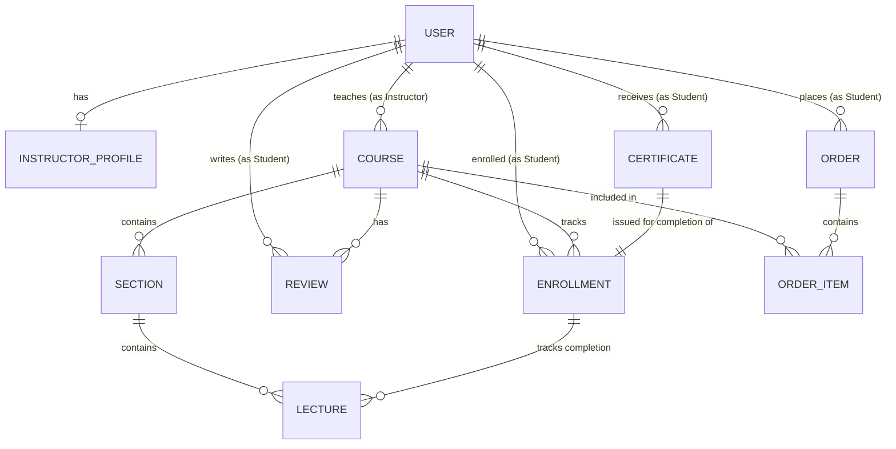

# NestJS Online Course Backend

A production-ready e-learning platform backend built with **NestJS**, following **Clean Architecture** and **Domain-Driven Design (DDD)** principles.

## 🚀 Overview

This project provides a robust backend infrastructure for an online learning system, supporting course creation, student enrollment, order processing, and certification. It is designed to be highly scalable, maintainable, and testable.

## 🛠️ Tech Stack

- **Framework:** NestJS (Node.js)
- **Language:** TypeScript
- **Database:** MongoDB (via Mongoose)
- **Architecture:** Clean Architecture, DDD, Aggregate Roots, Value Objects
- **Key Features:** 
  - Modular structure (Package-by-Feature)
  - Domain-Driven Design (Entities, Aggregates, VOs)
  - Event-driven patterns (Internal Events)
  - Centralized Error Handling

## 📊 Entity Relationship Diagram (ERD)

The domain model is structured around several core aggregates:



## 🧩 Core Domain Model

### 👤 User & Profiles
- **User**: The root entity for all users. Roles (Student/Instructor/Admin) determine permissions.
- **InstructorProfile**: A specialized profile containing biography, social links, and statistics for instructors.

### 📚 Course Aggregate
- **Course**: The primary container for learning content. Includes title, description, pricing, and status (Draft/Published).
- **Section**: Logical chapters within a course.
- **Lecture**: The actual content (Video or Article). Lectures are sequential and part of a Section.
- **Review**: Student feedback aggregate, linking students to courses with ratings and comments.

### 🎓 Enrollment & Progress
- **Enrollment**: Tracks a student's journey through a course. It maintains the state of completed lectures and calculates overall progress.
- **Certificate**: An immutable record issued when a student fulfills the course requirements.

### 💰 Commerce
- **Order**: Captures a student's purchase intent and payment status.
- **OrderItem**: Records the specific course(s) purchased and their price at the point of sale.

## 🏗️ Architecture Layers

The project follows a modified Clean Architecture approach:
1. **Domain Layer**: Contains Entities, Value Objects, and Domain Events. Completely independent of frameworks.
2. **Application Layer**: Contains Use Cases and Service interfaces.
3. **Infrastructure Layer**: Framework-specific implementations (Mongoose schemas, Repositories, External APIs).
4. **API Layer**: NestJS Controllers and DTOs.

## ⚙️ Getting Started

### Prerequisites
- Node.js (v18+)
- MongoDB (Running locally or via Docker)

### Installation
```bash
$ npm install
```

### Running the App
```bash
# development
$ npm run start:dev

# production
$ npm run start:prod
```

### Testing
```bash
$ npm run test        # Unit tests
$ npm run test:e2e    # End-to-end tests
$ npm run test:cov    # Coverage report
```

## 📜 License
This project is [MIT licensed](LICENSE).
